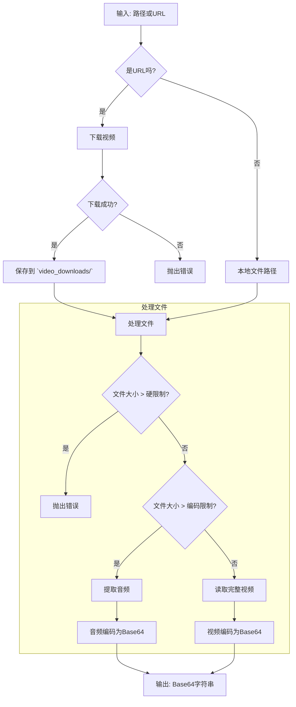

# 视频分析工具包

本项目提供了一个强大的工具，用于处理来自本地路径和 URL 的视频文件。它可以将视频转换为 Base64 字符串，通过仅提取音频来自动处理大文件，并为下载的视频提供持久化存储，以供备份和分析之用。

## 核心功能: `video_to_base64`

主要入口点是 `video_to_base64` 函数，该函数根据输入和文件大小智能地处理视频。工作流程如下图所示。

### 可视化工作流



### 主要特性

- **统一接口**: 单一函数 `video_to_base64` 即可处理本地文件路径和远程 URL。
- **智能大小处理**:
    - 如果视频小于 `encode_limit_bytes`，则对整个视频进行编码。
    - 如果视频大于 `encode_limit_bytes` 但小于 `hard_limit_bytes`，则仅提取并编码音轨。这为大视频节省了带宽和处理时间。
    - 如果视频超过 `hard_limit_bytes`，则会引发错误以防止过多的资源使用。
- **流式下载**: 从 URL 下载的视频以块（流）的形式进行，以最小化内存消耗。
- **持久化备份**: 从 URL 下载的所有视频都会自动保存在 `analysis_video/video_downloads/` 目录中，为日常分析创建了宝贵的备份。
- **音频提取**: 使用 `ffmpeg` 高效提取音频，首先尝试无损复制，如有必要则回退到 MP3 编码。

## 配置

处理的大小限制在 `analysis_video/config/settings.py` 的 `Base64Limits` 类中定义：

- `hard_limit_bytes`: 视频文件的绝对最大大小。任何大于此大小的文件都将被拒绝。
- `encode_limit_bytes`: 用于决定是编码整个视频还是仅编码音频的阈值。

## 如何使用

```python
from analysis_video.utils.video_base64 import video_to_base64

# --- 示例 1: 处理本地视频文件 ---
local_video_path = "/path/to/your/video.mp4"
base64_string = video_to_base64(local_video_path)
print(f"本地视频的 Base64: {base64_string[:100]}...")

# --- 示例 2: 处理来自 URL 的视频 ---
video_url = "http://example.com/remote_video.mp4"
base64_string_from_url = video_to_base64(video_url)
print(f"来自 URL 的 Base64: {base64_string_from_url[:100]}...")
# 来自 URL 的视频将保存在 `analysis_video/video_downloads/` 中
```