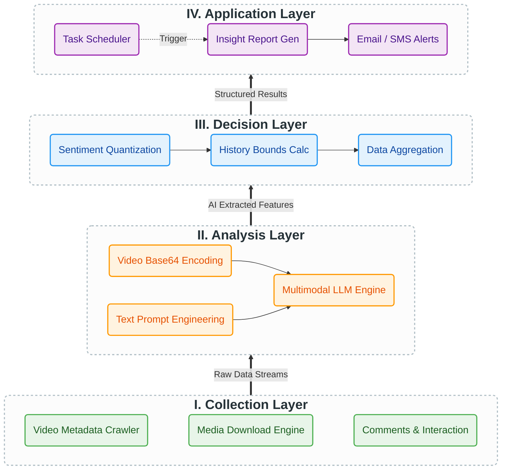

```mermaid
flowchart BT
    %% --- 全局与区块样式定义（已放大字体） ---
    classDef layerBox fill:#fcfcfc,stroke:#b0bec5,stroke-width:2px,stroke-dasharray: 4 4,rx:8px,ry:8px,color:#263238,font-weight:bold,font-size:24px;
    classDef collection fill:#e8f5e9,stroke:#4caf50,stroke-width:2px,color:#1b5e20,font-size:18px;
    classDef analysis fill:#fff3e0,stroke:#ff9800,stroke-width:2px,color:#e65100,font-size:18px;
    classDef decision fill:#e3f2fd,stroke:#2196f3,stroke-width:2px,color:#0d47a1,font-size:18px;
    classDef application fill:#f3e5f5,stroke:#9c27b0,stroke-width:2px,color:#4a148c,font-size:18px;

    %% --- 模块定义 ---
    subgraph L4 [IV. Application Layer]
        direction LR
        APP1(Task Scheduler):::application -.-> |Trigger| APP2(Insight Report Gen):::application
        APP2 --> APP3(Email / SMS Alerts):::application
    end

    subgraph L3 [III. Decision Layer]
        direction LR
        DEC1(Sentiment Quantization):::decision --> DEC2(History Bounds Calc):::decision
        DEC2 --> DEC3(Data Aggregation):::decision
    end

    subgraph L2 [II. Analysis Layer]
        direction LR
        ANA1(Video Base64 Encoding):::analysis --> ANA3(Multimodal LLM Engine):::analysis
        ANA2(Text Prompt Engineering):::analysis --> ANA3
    end

    subgraph L1 [I. Collection Layer]
        direction LR
        COL1(Video Metadata Crawler):::collection ~~~ COL3(Media Download Engine):::collection
        COL3 ~~~ COL2(Comments & Interaction):::collection
    end

    %% --- 数据流 ---
    L1 ==> |Raw Data Streams| L2
    L2 ==> |AI Extracted Features| L3
    L3 ==> |Structured Results| L4

    class L1,L2,L3,L4 layerBox
```