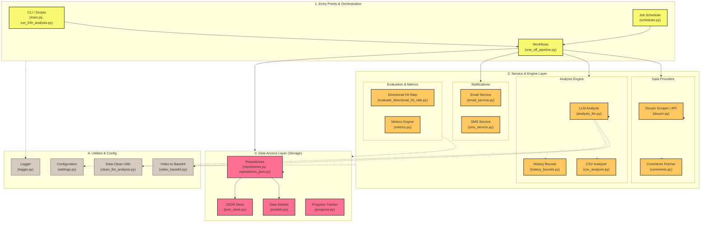

```mermaid
graph TD
    %% Define Styles
    classDef entry fill:#f9f871,stroke:#333,stroke-width:2px;
    classDef core fill:#ffc75f,stroke:#333,stroke-width:2px;
    classDef data fill:#ff9671,stroke:#333,stroke-width:2px;
    classDef storage fill:#ff6f91,stroke:#333,stroke-width:2px;
    classDef cross fill:#d5cabd,stroke:#333,stroke-width:1px;

    %% Entry Points & Orchestration
    subgraph Entry_Layer ["1. Entry Points & Orchestration"]
        CLI["CLI / Scripts<br>(main.py, run_24h_analysis.py)"]
        Scheduler["Job Scheduler<br>(scheduler.py)"]
        Workflows["Workflows<br>(one_off_pipeline.py)"]
    end
    class CLI,Scheduler,Workflows entry;

    %% Service / Engine Layer
    subgraph Service_Layer ["2. Service & Engine Layer"]
        subgraph Analysis_Engine ["Analysis Engine"]
            LLM_Analysis["LLM Analysis<br>(analysis_llm.py)"]
            CSV_Analyzer["CSV Analyzer<br>(csv_analyzer.py)"]
            History["History Bounds<br>(history_bounds.py)"]
        end
        
        subgraph Providers ["Data Providers"]
            DouyinAPI["Douyin Scraper / API<br>(douyin.py)"]
            CommentsAPI["Comments Fetcher<br>(comments.py)"]
        end

        subgraph Notification_Sys ["Notifications"]
            Email["Email Service<br>(email_service.py)"]
            SMS["SMS Service<br>(sms_service.py)"]
        end

        subgraph Eval_Metrics ["Evaluation & Metrics"]
            HitRate["Directional Hit Rate<br>(evaluate_directional_hit_rate.py)"]
            Metrics["Metrics Engine<br>(metrics.py)"]
        end
    end
    class LLM_Analysis,CSV_Analyzer,History,DouyinAPI,CommentsAPI,Email,SMS,HitRate,Metrics core;

    %% Data Access Layer
    subgraph Storage_Layer ["3. Data Access Layer (Storage)"]
        Repo["Repositories<br>(repositories.py, repositories_json.py)"]
        Models["Data Models<br>(models.py)"]
        Store["JSON Store<br>(json_store.py)"]
        Progress["Progress Tracker<br>(progress.py)"]
    end
    class Repo,Models,Store,Progress storage;

    %% Cross-cutting Concerns
    subgraph Cross_Cutting ["4. Utilities & Config"]
        Config["Configuration<br>(settings.py)"]
        Logger["Logger<br>(logger.py)"]
        VideoUtils["Video to Base64<br>(video_base64.py)"]
        CleanUtils["Data Clean Utils<br>(clean_llm_analysis.py)"]
    end
    class Config,Logger,VideoUtils,CleanUtils cross;

    %% Define Relationships
    CLI --> Workflows
    Scheduler --> Workflows
    
    Workflows --> Providers
    Workflows --> Analysis_Engine
    Workflows --> Notification_Sys
    Workflows --> Storage_Layer

    Providers --> DouyinAPI
    Providers --> CommentsAPI

    Analysis_Engine --> LLM_Analysis
    Analysis_Engine --> CSV_Analyzer
    Analysis_Engine --> History
    
    LLM_Analysis -.-> VideoUtils
    LLM_Analysis -.-> CleanUtils

    Storage_Layer --> Repo
    Repo --> Models
    Repo --> Store

    Eval_Metrics -.-> Storage_Layer
    
    %% Implicit dependency on cross cutting modules
    Entry_Layer -.-> Logger
    Service_Layer -.-> Config

```